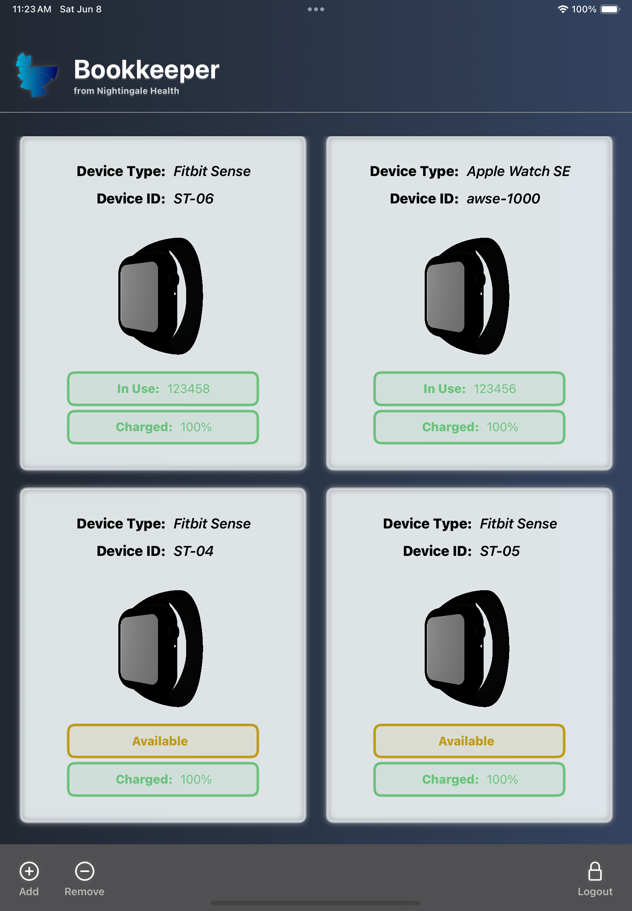
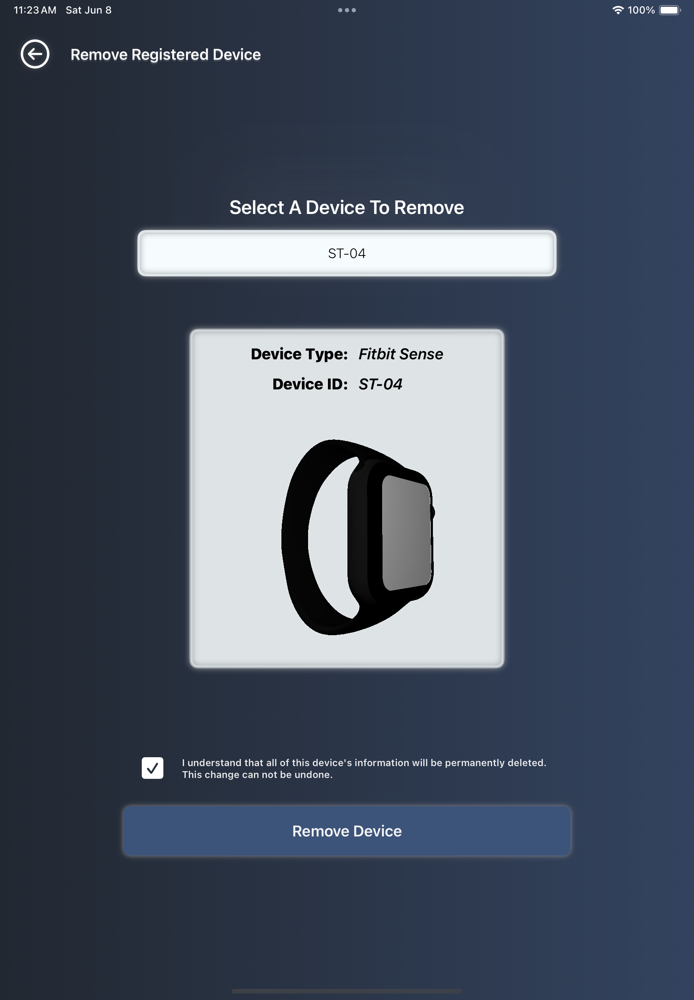
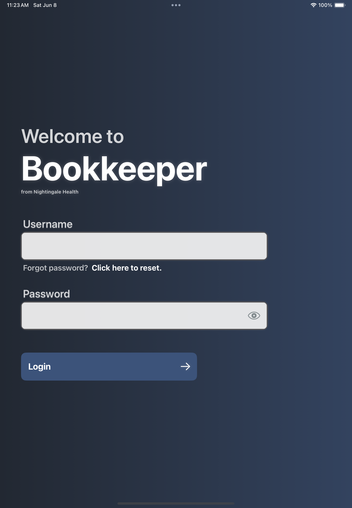

# Nightingale-Bookkeeper

At Nightingale, managing our growing number of wearable devices for testing and development 
became challenging, so we developed Bookkeeper, a simple CRUD application for device registry management. 
Bookkeeper allows you to easily view device information, including availability, assignment logs, and battery 
percentage, and lets you add or remove devices without complex database operations. Seamless integration with 
the Vektor API enables you to sign in with your Nightingale Health credentials to access and manage your 
device registry efficiently.

# Installation
Because this software does not currently exist as a directly downloadable application from the Apple app store, you will have to install XCode to download it to your devices. The only thing you will have to change is the code signature for the build target in the project file. Steps will be taken in the future to mae the download process more user friendly.  

# Functionality and Authentication
After installing to your device with an XCode editor, you can sign in with your Nightingale Health credentials. The app will access your device registry so that you can view current assignment and availability, curerent battery level, and previous assignment logs for each device. You can also begin adding and removing devices from your registry from directly within the app. 

# Device Manager Dashboard

# Add Device Dashboard

# Remove Device Dashboard

# Authentication Page

